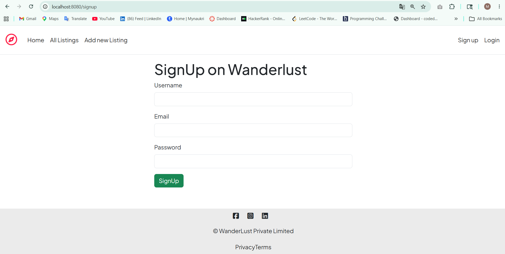
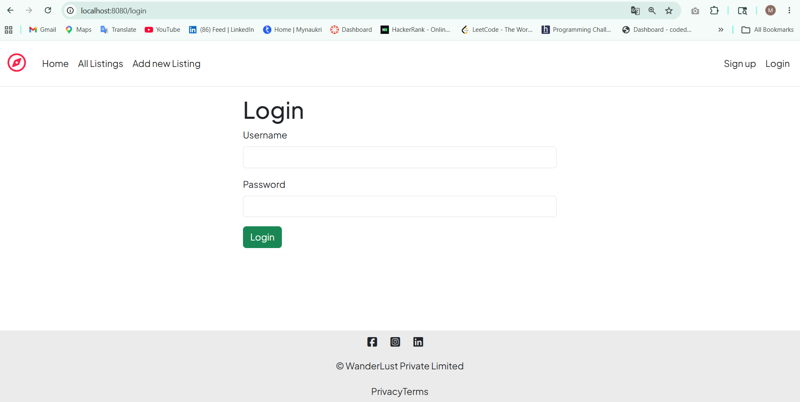
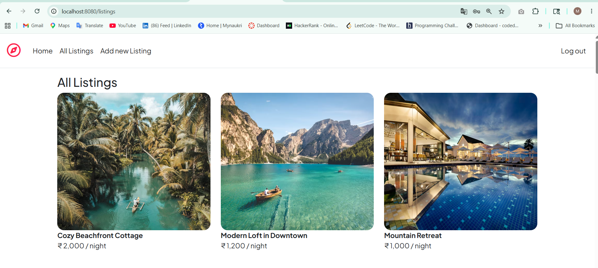
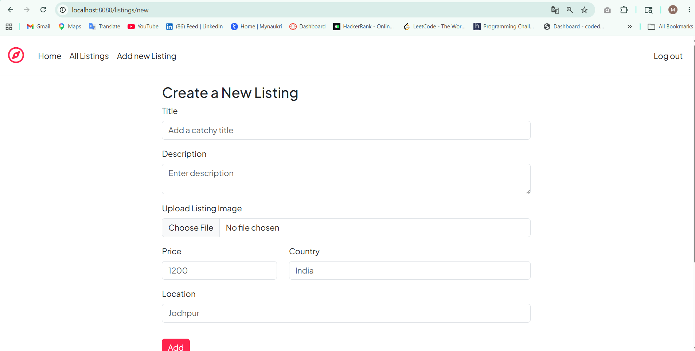

# 🌍 Wanderlust

Wanderlust is a full-stack travel listing web application where users can explore destinations, create and manage listings, and share reviews. The application includes user authentication, image uploads, and complete CRUD functionality.

## 🚀 Features

- User Signup and Login
- User Authentication and Authorization
- View All Listings
- View Individual Listing Details
- Create New Listings
- Edit Existing Listings
- Delete Listings
- Add Reviews
- Delete Reviews
- Image Upload 
- Error Handling
- Responsive User Interface

## 🛠️ Tech Stack

### Frontend
- React.js
- HTML5
- CSS3
- JavaScript
- EJS (Embedded JavaScript Templates)

### Backend
- Node.js
- Express.js

### Database
- MongoDB
- Mongoose

### Authentication & Other Tools
- Passport.js
- Express Session
- Connect Flash
- Cloudinary
- Multer
- Joi

## 📸 Project Screenshots

### SignUp Page


### Login Details


### All Listings Page


### Create New Listing Page


## 📂 Project Structure

```text
WANDERLUST/
│
├── controllers/
│   ├── listings.js
│   ├── reviews.js
│   └── users.js
│
├── init/
│   ├── data.js
│   └── index.js
│
├── models/
│   ├── listing.js
│   ├── review.js
│   └── user.js
│
├── public/
│   ├── css/
│   ├── images/
│   └── js/
│
├── routes/
│   ├── listing.js
│   ├── review.js
│   └── user.js
│
├── utils/
│   ├── ExpressError.js
│   └── wrapAsync.js
│
├── views/
│   ├── includes/
│   │   ├── flash.ejs
│   │   ├── footer.ejs
│   │   └── navbar.ejs
│   │
│   ├── layouts/
│   │   └── boilerplate.ejs
│   │
│   ├── listings/
│   │   ├── edit.ejs
│   │   ├── index.ejs
│   │   ├── new.ejs
│   │   └── show.ejs
│   │
│   ├── users/
│   │   ├── login.ejs
│   │   └── signup.ejs
│   │
│   └── error.ejs
│
├── .env
├── app.js
├── cloudConfig.js
├── middleware.js
├── package.json
└── package-lock.json
```

## ⚙️ Installation and Setup

### 1. Clone the Repository

```bash
git clone https://github.com/MaheshSuthar01/Wanderlust.git
cd WANDERLUST
```

### 2. Install Dependencies

```bash
npm install
```

### 3. Create a `.env` File

Create a `.env` file in the root directory:

```env
CLOUD_NAME=your_cloudinary_cloud_name
CLOUD_API_KEY=your_cloudinary_api_key
CLOUD_API_SECRET=your_cloudinary_api_secret

ATLASDB_URL=your_mongodb_connection_string

SECRET=your_session_secret
```

## ▶️ Run the Project

```bash
node app.js
```

Or using Nodemon:

```bash
nodemon app.js
```

Open the application in your browser:

```text
http://localhost:8080
```

## 📌 Main Modules

### Listings
Users can create, view, edit, and delete listings.

### Reviews
Authenticated users can add and delete reviews for listings.

### User Authentication
Users can create an account, log in, and log out securely.

### Image Upload
Listing images are uploaded and managed using Cloudinary.


## 👨‍💻 Author

**Mahesh Suthar**

## 📄 License
 This project is created for educational and learning purposes.

